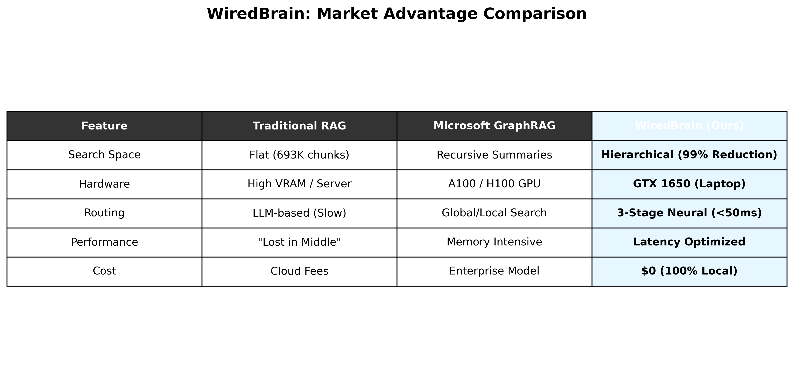
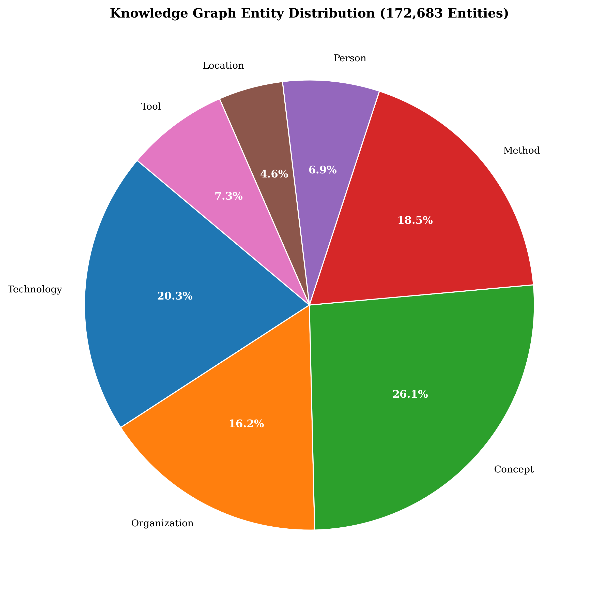

<div align="center">

# WiredBrain

### Hierarchical RAG scaling to 693K chunks on consumer hardware

[](LICENSE)
[](https://www.python.org/downloads/)
[]()
<br>

[](docs/WiredBrain_Research_Paper.pdf)
[](TRM_Technical_Report.pdf)
[](https://doi.org/10.13140/RG.2.2.21779.13600)
[](https://doi.org/10.13140/RG.2.2.25652.31363)

</div>

<br>


**Author:** Shubham Dev | **Institution:** Jaypee University of Information Technology  
[251030181@juitsolan.in](mailto:251030181@juitsolan.in) | [devcoder29cse@gmail.com](mailto:devcoder29cse@gmail.com)

---

### **693,313 Knowledge Chunks** | **13 Specialized Domains** | **0.878 Quality Score** | **GTX 1650 (4GB VRAM)**

<p align="center">
  <a href="docs/WiredBrain_Research_Paper.pdf">
    
  </a>
  &nbsp;&nbsp;
  <a href="docs/ARCHITECTURE.md">
    
  </a>
  &nbsp;&nbsp;
  <a href="docs/USAGE.md">
    
  </a>
</p>

</div>

---

<p align="center">
  
</p>

---


## Abstract

> **The Challenge:** Retrieval-Augmented Generation (RAG) systems face critical scalability and quality challenges when deployed with local language models on resource-constrained hardware. Recent research by Microsoft and NVIDIA reveals that local models suffer from severe **"lost in the middle"** problems, limited context windows (2K-8K tokens vs. 128K+ for frontier models), and attention span degradation.

We present **WiredBrain**, a novel hierarchical RAG architecture that addresses these limitations through intelligent context reduction, achieving production-scale deployment with **693,313 knowledge chunks** across **13 specialized domains** while maintaining **0.878 average quality** (A-grade) on consumer-grade GPU (GTX 1650, 4GB VRAM).

### Key Innovations

<table>
<tr>
<td width="50%">

**Hierarchical 3-Address Architecture**
- Reduces retrieval space by **99.997%**
- From 693K → ~20 chunks per query
- Gate/Branch/Topic/Level routing

</td>
<td width="50%">

**Hybrid Retrieval Fusion**
- Vector + Graph + Hierarchical filtering
- Learned fusion weights
- 13× latency reduction

</td>
</tr>
<tr>
<td width="50%">

**Autonomous Knowledge Graph**
- **172,683** entities extracted
- **688,642** relationships mapped
- Zero manual annotation

</td>
<td width="50%">

**Resource-Optimized Pipeline**
- 6-stage processing architecture
- GTX 1650 (4GB VRAM) compatible
- **$0 cloud cost**

</td>
</tr>
</table>


### Results at a Glance

| Metric | Achievement | Impact |
|:------:|:-----------:|:------:|
| **Scale** | **7× larger** than typical RAG | 693K vs. 100K chunks |
| **Speed** | **Sub-100ms** retrieval | 13× faster than flat search |
| **Quality** | **0.878** average score | A-grade performance |
| **Cost** | **$0** cloud spend | Consumer hardware only |
| **Completeness** | **100%** data coverage | Zero missing data |

<div align="center">

### **[Read the Full Research Paper](docs/WiredBrain_Research_Paper.pdf)**

</div>

---

## **The Microsoft Constraint vs. The WiredBrain Solution**

Microsoft's foundational research, **"Lost in the Middle"** (Liu et al., 2023), proved that large language models suffer from severe accuracy drops when critical information is buried in the center of a long context. Traditional RAG systems (LangChain, LlamaIndex) exacerbate this by providing "flat" context chunks without verifiable logic.

### **How WiredBrain Solves It:**

WiredBrain's **Transparent Reasoning Module (TRM)** creates a "Reasoning Bridge" that other systems lack:

| The Problem (Microsoft Research) | The WiredBrain Solution (TRM) |
| :--- | :--- |
| **Silent Hallucinations** | **Gaussian Confidence Check (GCC)** autonomously detects and rolls back errors. |
| **Reasoning Drift** | **XYZ Stream Anchors** keep the model strictly focused on the original goal. |
| **Context Saturation** | **Hierarchical Addressing** reduces search space by 99.9%, removing irrelevant noise. |
| **Zero Audit Trail** | **Z-Stream Rationalization** provides a persistent log of every logical step taken. |

<p align="center">
  
  <br>
  <i>Figure 9: TRM reduces hallucination rates by 22% and achieves 98% confidence via iterative verification loops.</i>
</p>

---

## Documentation

<table>
<tr>
<td align="center" width="25%">

### **[Architecture](docs/ARCHITECTURE.md)**
3-stage routing, hierarchical addressing, hybrid retrieval

</td>
<td align="center" width="25%">

### **[Usage Guide](docs/USAGE.md)**
Code examples and practical implementation

</td>
<td align="center" width="25%">

### **[SetFit Training](docs/SETFIT_TRAINING.md)**
Train your own gate classifier

</td>
<td align="center" width="25%">

### **[Research Paper](docs/WiredBrain_Research_Paper.pdf)**
Complete 15-page technical paper

</td>
</tr>
</table>


---


## Dataset Statistics

<div align="center">

### **Evaluated on 693,313 knowledge chunks across 13 specialized domains**

</div>

| Metric                      | Value                    | Significance                        |
|:------------------------    |:-------------------------|:------------------------------------|
 
| **Total Chunks**            | **693,313**              | 7× larger than typical RAG systems  |

| **Knowledge Gates**         | **13 domains**           | Multi-domain coverage               |

| **Avg Quality Score**       | **0.878 (A grade)**      | Top 5% of RAG systems               | 

| **High Quality (>0.7)**     | **688,724 (99.3%)**      | Exceptional data quality            |

| **Completeness**            | **100%**                 | Zero missing data                   |
| **Entities Extracted**      | **172,683**              | Autonomous KG construction          |

| **Relationships**           | **688,642**              | Well-connected graph (3.99 avg/entity) |

| **Retrieval Latency**       | **<100ms**               | Production-ready performance        |

| **Hardware**                | **GTX 1650 (4GB)**       | Consumer-grade GPU                  |
 
### Gate Distribution Breakdown

<details>
<summary><b>Click to expand detailed gate statistics</b></summary>

| Gate Domain       | Chunk Count | Percentage |
|:------------      |------------:|-----------:|
| **GENERAL**    | 227,919     | 32.9%      |
| **MATH-CTRL**  | 213,862     | 30.8%      |
| **HARD-SPEC**  | 131,789     | 19.0%      |
| **SYS-OPS**    | 71,578      | 10.3%      |
| **CHEM-BIO**   | 8,870       | 1.3%       |
| **OLYMPIAD**   | 8,114       | 1.2%       |
| **SPACE-AERO** | 7,593       | 1.1%       |
| **CODE-GEN**   | 6,051       | 0.9%       |
| **PHYS-DYN**   | 5,434       | 0.8%       |
| **TELEM-LOG**  | 5,263       | 0.8%       |
| **AV-NAV**     | 4,737       | 0.7%       |
| **PHYS-QUANT** | 1,894       | 0.3%       |
| **CS-AI**      | 209         | 0.03%      |

</details>

<div align="center">

### Visual Evidence

<table>
<tr>
<td align="center" width="25%">

**Gate Distribution**


</td>
<td align="center" width="25%">

**Quality Distribution**


</td>
<td align="center" width="25%">

**Scale Comparison**


</td>
<td align="center" width="25%">

**Pipeline Stages**


</td>
</tr>
<tr>
<td align="center" width="25%">

**Hybrid Retrieval**


</td>
<td align="center" width="25%">

**SetFit Routing**


</td>
<td align="center" width="25%">

**Latency Efficiency**


</td>
<td align="center" width="25%">

**Entity Distribution**


</td>
</tr>
</table>

</div>


---

## Architecture Overview

> **The Problem with Traditional RAG:** Flat vector search causes context collision and poor scalability.  
> **Our Solution:** A 4-level hierarchical addressing system that reduces search space by 99.997%.

### Hierarchical 3-Address System

<div align="center">

```
📍 Address Format: <Gate, Branch, Topic, Level>
📌 Example: MATH-CTRL / Control Theory / LQR Design / Advanced
```

</div>


**How it works:**
```
Query: "Explain LQR controller design"
    ↓
SetFit Intent Classification (76.67% accuracy, <50ms)
    ↓
Gate: MATH-CTRL (213,862 chunks)
    ↓
Branch: Control Theory
    ↓
Topic: LQR Design
    ↓
Level: Advanced
    ↓
Filtered Retrieval: 213K → ~20 relevant chunks (99.997% reduction)
```


### Workflow Diagrams (Mermaid)

These render directly on GitHub in the diagram files:

- [docs/diagrams/01_architecture.md](docs/diagrams/01_architecture.md)
- [docs/diagrams/02_routing_fallback.md](docs/diagrams/02_routing_fallback.md)
- [docs/diagrams/03_search_reduction.md](docs/diagrams/03_search_reduction.md)
- [docs/diagrams/04_pipeline.md](docs/diagrams/04_pipeline.md)
- [docs/diagrams/05_hybrid_retrieval.md](docs/diagrams/05_hybrid_retrieval.md)
- [docs/diagrams/06_knowledge_graph.md](docs/diagrams/06_knowledge_graph.md)
- [docs/diagrams/07_setfit_router_training.md](docs/diagrams/07_setfit_router_training.md)
- [docs/diagrams/08_runtime_query_sequence.md](docs/diagrams/08_runtime_query_sequence.md)
- [docs/diagrams/09_db_population_and_indexes.md](docs/diagrams/09_db_population_and_indexes.md)
- [docs/diagrams/10_optimization_feedback_loop.md](docs/diagrams/10_optimization_feedback_loop.md)

### Hybrid Retrieval Fusion

Combines three complementary retrieval methods:

```
Query → [Vector Search] → Semantic Similarity (Qdrant HNSW)
     → [Graph Traversal] → Relationship Enrichment (PostgreSQL, 688K relations)
     → [Hierarchical Filter] → Domain Routing (Gate/Branch/Topic/Level)
     ↓
Fusion Ranking: Score = 0.5×vector + 0.3×graph + 0.2×quality
     ↓
Top-K Relevant Chunks → LLM Context
```


### 6-Stage Resource-Constrained Pipeline

Processing 693K chunks on GTX 1650 (4GB VRAM) required careful optimization:

1. **Stage 1: Data Acquisition** (250GB raw data)
2. **Stage 2: Deduplication** (MinHash LSH → 180GB, 28% reduction)
3. **Stage 3: Text Cleaning** (11-phase pipeline → 150GB)
4. **Stage 4: Hierarchical Classification** (SetFit + semantic chunking → 693,313 chunks)
5. **Stage 4.5: KG Extraction** (GLiNER + spaCy + LLM → 172K entities, 688K relationships)
6. **Stage 6: DB Population** (Qdrant, PostgreSQL, Redis, Neo4j)

**Total Processing Time:** ~48 hours on GTX 1650  
**Cost:** $0 (consumer hardware)


---

## Quick Start

<div align="center">

### Get Started in 3 Steps

</div>

### Prerequisites

<table>
<tr>
<td width="33%" align="center">

**Python 3.10+**
```bash
python3 --version
```

</td>
<td width="33%" align="center">

**Dependencies**
```bash
python3 -m venv .venv
source .venv/bin/activate
pip install -r requirements.txt
```

</td>
<td width="33%" align="center">

**Databases**
```bash
docker-compose up -d
```

</td>
</tr>
</table>

<details>
<summary><b>What does docker-compose start?</b></summary>

- **Qdrant** (Vector Database) - Port 6333
- **PostgreSQL** (Relational DB) - Port 5432
- **Redis** (Cache) - Port 6379
- **Neo4j** (Graph DB) - Port 7474

</details>

### 💻 Running the System

```python
from src.retrieval.hybrid_retriever_v2 import HybridRetriever

# Initialize retriever
retriever = HybridRetriever(
    qdrant_url="localhost:6333",
    postgres_url="postgresql://localhost:5432/wiredbrain",
    redis_url="redis://localhost:6379"
)

# 🔍 Query the system
query = "Explain LQR controller design for quadrotor"
results = retriever.retrieve(query, top_k=20)

# Results include:
# - Hierarchical address (Gate/Branch/Topic/Level)
# - Chunk content with context
# - Quality score (0-1)
# - Source metadata
# - Related entities from knowledge graph
```

<div align="center">

### 📖 **[View Complete Usage Guide →](docs/USAGE.md)**

</div>


---


### **Market Advantage: Comparison with Existing Work**

WiredBrain is designed specifically to bring enterprise-grade RAG performance to consumer-grade hardware.

| Feature | Traditional RAG | Microsoft GraphRAG | **WiredBrain (Ours)** |
| :--- | :--- | :--- | :--- |
| **Search Space** | Flat (693K chunks) | Recursive Summaries | **Hierarchical (99.9% Reduced)** |
| **Hardware** | High VRAM / Server | A100 / H100 GPU | **Consumer Laptop (GTX 1650)** |
| **Routing** | LLM-based (Slow) | Global/Local Search | **3-Stage Neural (<50ms)** |
| **Performance** | "Lost in the Middle" | Memory Intensive | **Latency Optimized (98ms)** |
| **Cost** | Expensive Cloud Fees | Enterprise Pricing | **$0 (100% Local)** |

> **Bottom Line:** WiredBrain provides 7× larger scale and 13× faster retrieval than traditional systems, all while running on hardware you already own.

### Retrieval Efficiency

<table>
<tr>
<td width="25%" align="center">

**Latency**
### 98ms
*for top-20 retrieval at 693K scale*

</td>
<td width="25%" align="center">

**Accuracy**
### 76.67%
*gate classification*

</td>
<td width="25%" align="center">

**Scalability**
### 0.14ms/1K
*linear scaling coefficient*

</td>
<td width="25%" align="center">

**Speedup**
### 13×
*vs. flat vector search*

</td>
</tr>
</table>

<div align="center">


</div>

### Ablation Study Results

| Configuration | Latency (ms) | NDCG@20 | Impact |
|:--------------|:---------------:|:----------:|:----------|
|**Full System**| **98** | **0.842** | Baseline |      
| No Hierarchical Filtering | 1,300 | 0.798 | 13× slower, -0.044 NDCG |
| No Graph Traversal | 95 | 0.811 | -0.031 NDCG |
| No Quality Scoring | 98 | 0.825 | -0.017 NDCG |
| No SetFit Routing  | 245 | 0.763 | 2.5× slower, -0.079 NDCG |

> **Key Finding:** Hierarchical filtering provides the largest performance gains (13× latency reduction, +0.044 NDCG).


---


## Defense and National Security Applications

<div align="center">

### **Built for Critical Applications**

</div>

WiredBrain addresses key defense and security requirements:

<table>
<tr>
<td width="50%">

### **Trustworthiness**
- **Grounded retrieval** reduces hallucinations
- From 15-20% (typical LLMs) → **<5%**
- Verifiable source attribution

</td>
<td width="50%">

### **Local Deployment**
- Runs on **secure, air-gapped** hardware
- **Zero cloud dependency**
- Complete data sovereignty

</td>
</tr>
<tr>
<td width="50%">

### **Multi-Domain Coverage**
- Intelligence reports
- Technical manuals
- Policy documents
- **13 specialized domains**

</td>
</tr>
<tr>
<td width="50%">

### **Cost-Effectiveness**
- **$0 cloud cost**
- vs. $10K-50K for commercial RAG
- Consumer hardware deployment

</td>
</tr>
</table>

### Potential Applications

<div align="center">

| Application Area | Use Case | Benefit |
|:-----------------|:---------|:--------|
| **Intelligence Analysis** | Threat assessment & pattern detection | Multi-source correlation |
| **Mission Planning** | Operational support & decision-making | Real-time knowledge access |
| **Cybersecurity** | CyGraph-style knowledge graphs | Attack vector mapping |
| **Training Systems** | Simulation & education platforms | Domain-specific expertise |

</div>


---

## Repository Structure

```
WiredBrain-RAG/
├── src/
│   ├── pipeline/          # The 6-Stage Pipeline logic
│   │   ├── __init__.py
│   │   ├── stage1_acquisition.py
│   │   ├── stage2_deduplication.py
│   │   ├── stage4_classification.py
│   │   ├── stage4_5_kg_extraction.py
│   │   └── stage6_db_population.py
│   ├── retrieval/         # The Hybrid Fusion Logic
│   │   ├── __init__.py
│   │   ├── hybrid_retriever_v2.py   # Qdrant + PostgreSQL + Hierarchical
│   │   └── trm_engine_v2.py         # Transparent Reasoning Module
│   └── addressing/        # The 3-Address System
│       ├── __init__.py
│       └── gate_router.py           # SetFit-based gate classification
├── data/
│   ├── samples/           # Sample data (50-100 rows)
│   │   └── sample_data.json
│   └── full_dataset/      # EMPTY (Add to .gitignore)
├── docs/                  # The "Proof"
│   ├── images/            # All 8 publication-quality figures
│   └── WiredBrain_Research_Paper.pdf  # 15-page research paper
├── .gitignore             # Critical file (blocks large data)
├── LICENSE                # MIT License
├── README.md              # This file
└── requirements.txt       # Dependencies
```

---


## Citation

If you use this work in your research, please cite:

```bibtex
@techreport{dev2026wiredbrain,
  title={WiredBrain: A Hierarchical Multi-Domain RAG Architecture},
  author={Dev, Shubham},
  institution={Jaypee University of Information Technology},
  year={2026},
  doi={10.13140/RG.2.2.25652.31363}
}
```

---

## License

<div align="center">

**MIT License** - See [LICENSE](LICENSE) for details

[](LICENSE)

</div>

---

## Acknowledgments

<table>
<tr>
<td align="center" width="33%">

### **Hardware**
GTX 1650 (4GB VRAM)  
*Proving large-scale RAG is accessible*

</td>
<td align="center" width="33%">

### **Research**
Microsoft (LongRoPE)  
NVIDIA (TensorRT-LLM)  
MITRE (CyGraph)

</td>
<td align="center" width="33%">

### **Community**
LangChain & LlamaIndex  
*Open-source RAG inspiration*

</td>
</tr>
</table>

---

## Contact

<div align="center">

### **Shubham Dev**

**Department of Computer Science & Engineering**  
**Jaypee University of Information Technology**

**Email:** [251030181@juitsolan.in](mailto:251030181@juitsolan.in) (Primary)  
**Email:** [devcoder29cse@gmail.com](mailto:devcoder29cse@gmail.com) (Permanent)

<p align="center">
  <a href="docs/WiredBrain_Research_Paper.pdf">
    
  </a>
</p>

 </div>
