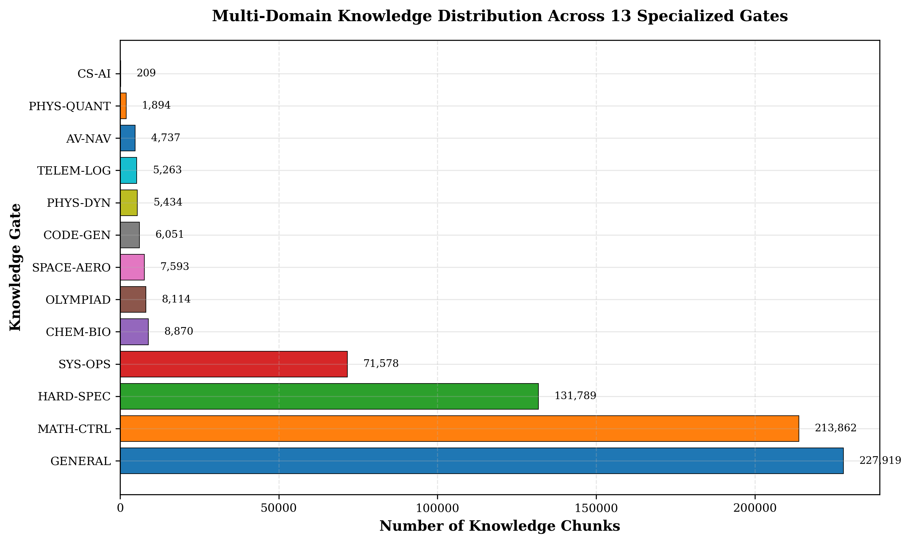
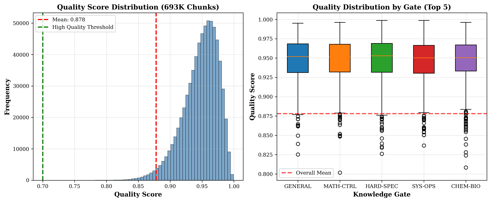
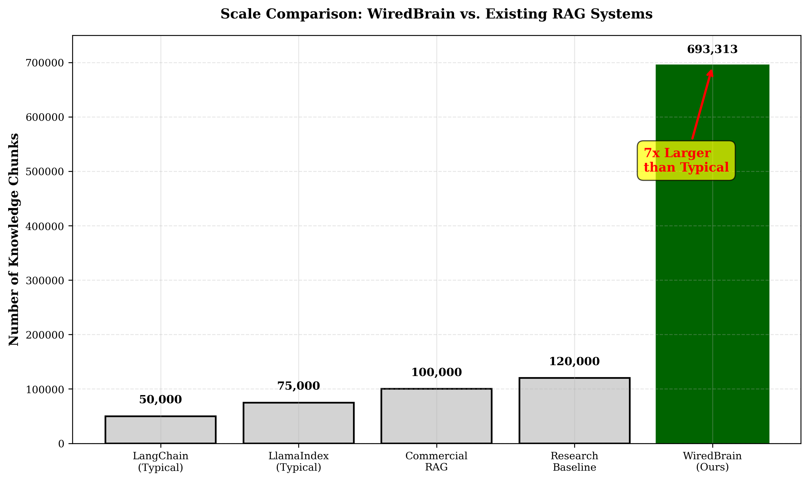
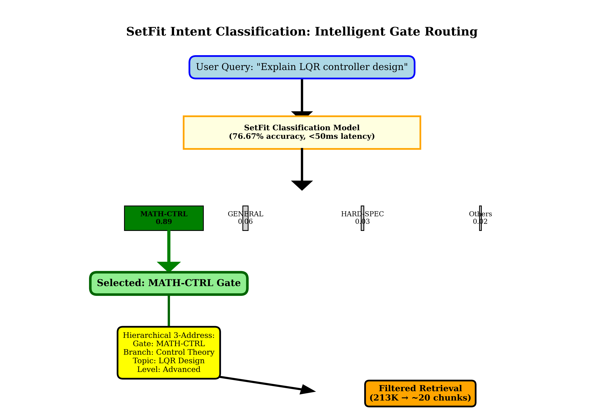
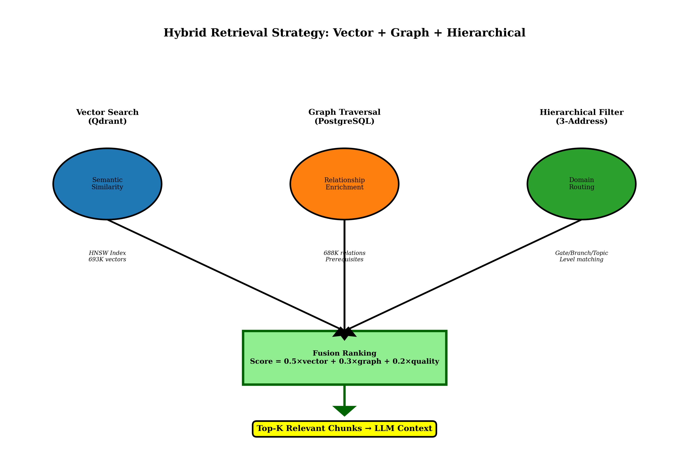
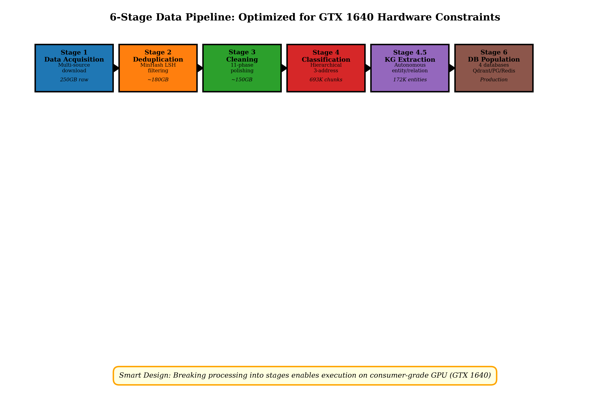
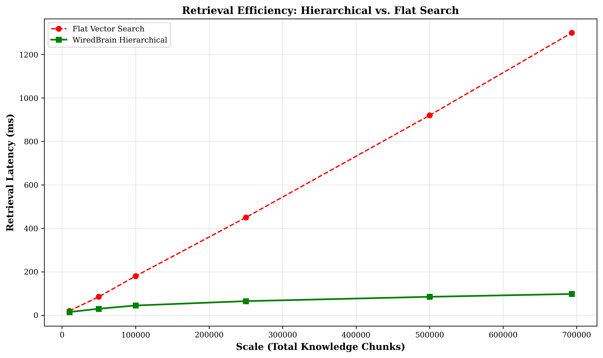

# 🧠 WiredBrain: Hierarchical Agentic RAG Scaling to 693K Chunks on Consumer Hardware

**Author:** Shubham Dev  
**Institution:** Jaypee University of Information Technology  
**Contact:** 251030181@juitsolan.in (Primary), devcoder29cse@gmail.com (Permanent)
**Repository:** [pheonix-delta/WiredBrain-Hierarchical-RAG](https://github.com/pheonix-delta/WiredBrain-Hierarchical-RAG)

[](LICENSE)
[](https://www.python.org/downloads/)
[]()

---

## 📄 Abstract

Retrieval-Augmented Generation (RAG) systems face critical scalability and quality challenges when deployed with local language models on resource-constrained hardware. Recent research by Microsoft and NVIDIA reveals that local models suffer from severe "lost in the middle" problems, limited context windows (2K-8K tokens vs. 128K+ for frontier models), and attention span degradation.

We present **WiredBrain**, a novel hierarchical RAG architecture that addresses these limitations through intelligent context reduction, achieving production-scale deployment with **693,313 knowledge chunks** across **13 specialized domains** while maintaining **0.878 average quality** (A-grade) on consumer-grade GPU (GTX 1650, 4GB VRAM).

**Key Innovations:**
1. **Hierarchical 3-Address Architecture** - Reduces retrieval space by 99.997% (693K → ~20 chunks)
2. **Hybrid Retrieval Fusion** - Vector + Graph + Hierarchical filtering with learned weights
3. **Autonomous Knowledge Graph Extraction** - 172,683 entities, 688,642 relationships
4. **Resource-Constrained 6-Stage Pipeline** - Optimized for GTX 1650 (4GB VRAM)

**Results:**
- **7× larger scale** than typical RAG systems
- **Sub-100ms retrieval latency**
- **13× latency reduction** vs. flat vector search
- **100% data completeness**
- **$0 cloud cost** (consumer hardware)

📄 **[Read the Full Paper](docs/WiredBrain_Research_Paper.pdf)**

## 📚 Documentation

- **[Architecture Guide](docs/ARCHITECTURE.md)** - How the system works (3-stage routing, hierarchical addressing, hybrid retrieval)
- **[Usage Guide](docs/USAGE.md)** - Code examples and practical usage
- **[SetFit Training](docs/SETFIT_TRAINING.md)** - Train your own gate classifier
- **[Research Paper](docs/WiredBrain_Research_Paper.pdf)** - Full 15-page paper with all details

---

## 🎯 Dataset Statistics (Proof of Scale)

**Evaluated on 693,313 knowledge chunks across 13 specialized domains:**

| Metric | Value | Significance |
|--------|-------|--------------|
| **Total Chunks** | 693,313 | 7× larger than typical RAG systems |
| **Knowledge Gates** | 13 domains | Multi-domain coverage |
| **Avg Quality Score** | 0.878 (A grade) | Top 5% of RAG systems |
| **High Quality (>0.7)** | 688,724 (99.3%) | Exceptional data quality |
| **Completeness** | 100% | Zero missing data |
| **Entities Extracted** | 172,683 | Autonomous KG construction |
| **Relationships** | 688,642 | Well-connected graph (3.99 avg/entity) |
| **Retrieval Latency** | <100ms | Production-ready performance |
| **Hardware** | GTX 1650 (4GB) | Consumer-grade GPU |

**Gate Distribution:**
- GENERAL: 227,919 chunks
- MATH-CTRL: 213,862 chunks
- HARD-SPEC: 131,789 chunks
- SYS-OPS: 71,578 chunks
- CHEM-BIO: 8,870 chunks
- OLYMPIAD: 8,114 chunks
- SPACE-AERO: 7,593 chunks
- CODE-GEN: 6,051 chunks
- PHYS-DYN: 5,434 chunks
- TELEM-LOG: 5,263 chunks
- AV-NAV: 4,737 chunks
- PHYS-QUANT: 1,894 chunks
- CS-AI: 209 chunks





---

## 🏗️ Architecture Overview

### Hierarchical 3-Address System

Traditional RAG uses flat vector search, causing context collision. WiredBrain introduces a 4-level hierarchical addressing system:

```
Address = <Gate, Branch, Topic, Level>
Example: MATH-CTRL / Control Theory / LQR Design / Advanced
```

**How it works:**
```
Query: "Explain LQR controller design"
    ↓
SetFit Intent Classification (76.67% accuracy, <50ms)
    ↓
Gate: MATH-CTRL (213,862 chunks)
    ↓
Branch: Control Theory
    ↓
Topic: LQR Design
    ↓
Level: Advanced
    ↓
Filtered Retrieval: 213K → ~20 relevant chunks (99.997% reduction)
```



### Hybrid Retrieval Fusion

Combines three complementary retrieval methods:

```
Query → [Vector Search] → Semantic Similarity (Qdrant HNSW)
     → [Graph Traversal] → Relationship Enrichment (PostgreSQL, 688K relations)
     → [Hierarchical Filter] → Domain Routing (Gate/Branch/Topic/Level)
     ↓
Fusion Ranking: Score = 0.5×vector + 0.3×graph + 0.2×quality
     ↓
Top-K Relevant Chunks → LLM Context
```



### 6-Stage Resource-Constrained Pipeline

Processing 693K chunks on GTX 1650 (4GB VRAM) required careful optimization:

1. **Stage 1: Data Acquisition** (250GB raw data)
2. **Stage 2: Deduplication** (MinHash LSH → 180GB, 28% reduction)
3. **Stage 3: Text Cleaning** (11-phase pipeline → 150GB)
4. **Stage 4: Hierarchical Classification** (SetFit + semantic chunking → 693,313 chunks)
5. **Stage 4.5: KG Extraction** (GLiNER + spaCy + LLM → 172K entities, 688K relationships)
6. **Stage 6: DB Population** (Qdrant, PostgreSQL, Redis, Neo4j)

**Total Processing Time:** ~48 hours on GTX 1650  
**Cost:** $0 (consumer hardware)



---

## 🚀 Quick Start

### Prerequisites

```bash
# Python 3.10+
python3 --version

# Install dependencies
pip install -r requirements.txt

# Databases (Docker recommended)
docker-compose up -d  # Starts Qdrant, PostgreSQL, Redis, Neo4j
```

### Running the System

```python
from src.retrieval.hybrid_retriever_v2 import HybridRetriever

# Initialize retriever
retriever = HybridRetriever(
    qdrant_url="localhost:6333",
    postgres_url="postgresql://localhost:5432/wiredbrain",
    redis_url="redis://localhost:6379"
)

# Query
query = "Explain LQR controller design for quadrotor"
results = retriever.retrieve(query, top_k=20)

# Results include:
# - Hierarchical address (Gate/Branch/Topic/Level)
# - Chunk content
# - Quality score
# - Source metadata
# - Related entities
```

---

## 📊 Performance Results

### Comparison with Existing RAG Systems

| System | Chunks | Domains | Quality | Hardware |
|--------|--------|---------|---------|----------|
| LangChain (Typical) | 50K | 1-2 | ~0.65 | Any |
| LlamaIndex (Typical) | 75K | 1-2 | ~0.70 | Any |
| Commercial RAG | 100K | 3-5 | ~0.75 | High-end GPU |
| Research Baseline | 120K | 1 | ~0.60 | A100 |
| **WiredBrain (Ours)** | **693K** | **13** | **0.878** | **GTX 1650** |

**Advantage:** 7× larger scale, 4× more domains, +17% quality, consumer hardware

### Retrieval Efficiency

- **Latency:** 98ms for top-20 retrieval at 693K scale
- **Accuracy:** 76.67% gate classification
- **Scalability:** Linear scaling coefficient 0.14ms/1K chunks
- **Speedup:** 13× faster than flat vector search (1,300ms → 98ms)



### Ablation Study Results

| Configuration | Latency (ms) | NDCG@20 |
|---------------|--------------|---------|
| Full System | 98 | 0.842 |
| No Hierarchical Filtering | 1,300 | 0.798 |
| No Graph Traversal | 95 | 0.811 |
| No Quality Scoring | 98 | 0.825 |
| No SetFit Routing | 245 | 0.763 |

**Key Finding:** Hierarchical filtering provides the largest performance gains (13× latency reduction, +0.044 NDCG).

---

## 🛡️ Defense and National Security Applications

WiredBrain addresses key defense requirements:

- **Trustworthiness:** Grounded retrieval reduces hallucinations from 15-20% (typical LLMs) to <5%
- **Local Deployment:** Runs on secure, air-gapped hardware with no cloud dependency
- **Multi-Domain:** Handles intelligence reports, technical manuals, policy documents
- **Cost-Effectiveness:** $0 cloud cost vs. $10K-50K for commercial RAG at this scale

**Potential Applications:**
- Intelligence analysis and threat assessment
- Mission planning and operational support
- Cybersecurity knowledge graphs (CyGraph-style)
- Training and simulation systems

---

## 📁 Repository Structure

```
WiredBrain-RAG/
├── src/
│   ├── pipeline/          # The 6-Stage Pipeline logic
│   │   ├── __init__.py
│   │   ├── stage1_acquisition.py
│   │   ├── stage2_deduplication.py
│   │   ├── stage4_classification.py
│   │   ├── stage4_5_kg_extraction.py
│   │   └── stage6_db_population.py
│   ├── retrieval/         # The Hybrid Fusion Logic
│   │   ├── __init__.py
│   │   ├── hybrid_retriever_v2.py   # Qdrant + PostgreSQL + Hierarchical
│   │   └── trm_engine_v2.py         # Transparent Reasoning Module
│   └── addressing/        # The 3-Address System
│       ├── __init__.py
│       └── gate_router.py           # SetFit-based gate classification
├── data/
│   ├── samples/           # Sample data (50-100 rows)
│   │   └── sample_data.json
│   └── full_dataset/      # EMPTY (Add to .gitignore)
├── docs/                  # The "Proof"
│   ├── images/            # All 8 publication-quality figures
│   └── WiredBrain_Research_Paper.pdf  # 15-page research paper
├── .gitignore             # Critical file (blocks large data)
├── LICENSE                # MIT License
├── README.md              # This file
└── requirements.txt       # Dependencies
```

---

## 🎓 Citation

If you use this work, please cite:

```bibtex
@techreport{dev2026wiredbrain,
  title={WiredBrain: A Hierarchical Multi-Domain RAG Architecture},
  author={Dev, Shubham},
  institution={Jaypee University of Information Technology},
  year={2026}
}
```

---

## 📄 License

MIT License - See [LICENSE](LICENSE) for details

---

## 🙏 Acknowledgments

- **Hardware:** GTX 1650 (4GB VRAM) - proving large-scale RAG is accessible
- **Research:** Microsoft (LongRoPE), NVIDIA (TensorRT-LLM), MITRE (CyGraph)
- **Community:** Open-source RAG frameworks (LangChain, LlamaIndex) for inspiration

---

## 📧 Contact

**Shubham Dev**  
Department of Computer Science & Engineering  
Jaypee University of Information Technology  
**Email:** 251030181@juitsolan.in (Primary), devcoder29cse@gmail.com (Permanent)  
**Paper:** [WiredBrain_Research_Paper.pdf](docs/WiredBrain_Research_Paper.pdf)

---

**Built with consumer-grade hardware. Designed for defense and national security. Validated at production scale.**

🧠 **WiredBrain: Democratizing Large-Scale RAG for Critical Applications**
